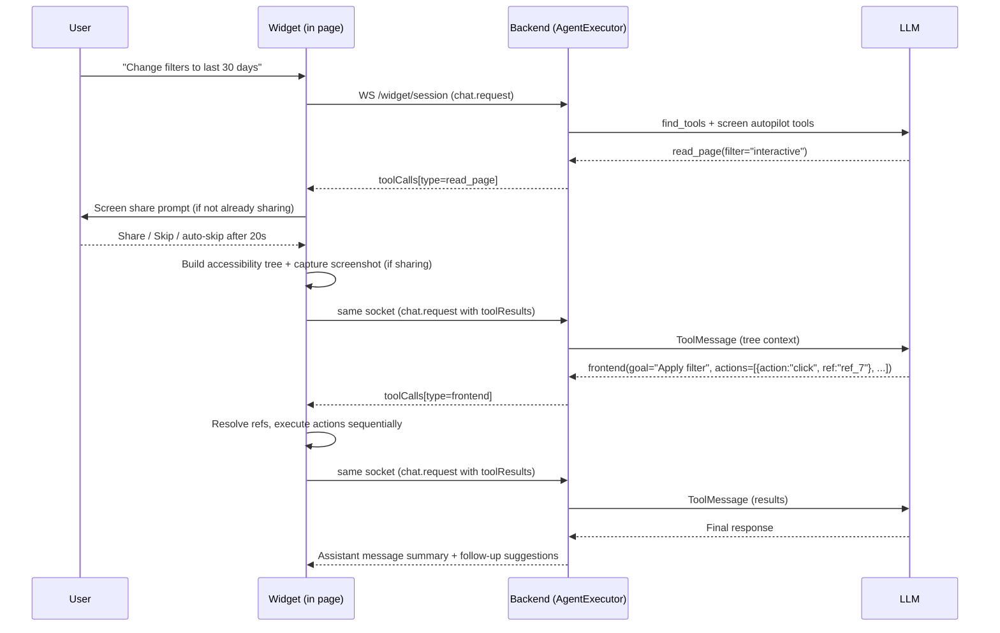
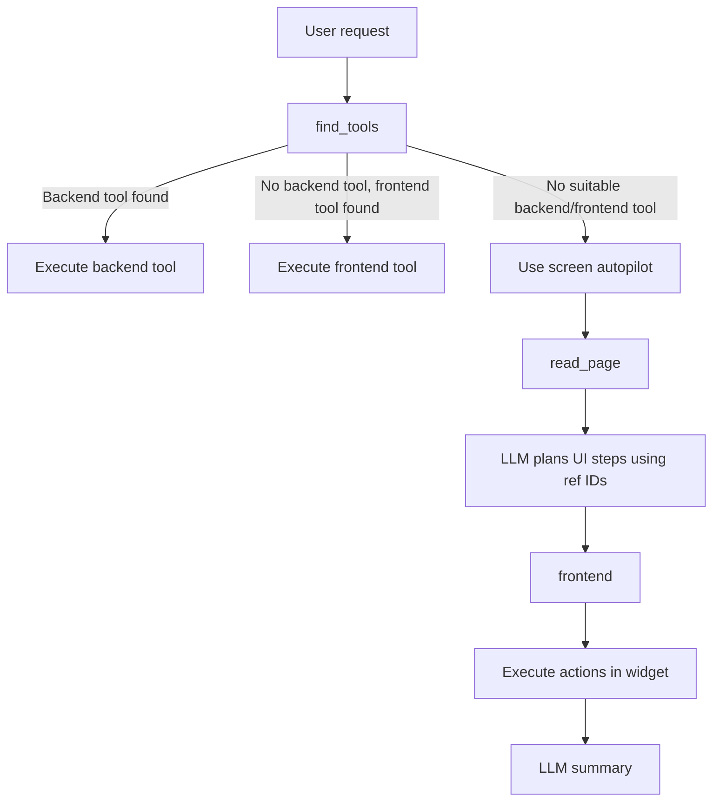

# Frontend Agent Capability (Widget)

## Overview
The Warpy agent can observe and act on the host dashboard directly. Four always-available frontend tools give it this ability:

- **`read_page`** — returns a hierarchical accessibility tree of the current page with stable ref IDs for each element. Includes a screenshot when tab screen sharing is active.
- **`find_elements`** — searches for elements by natural language description, returning matching elements with ref IDs.
- **`frontend`** — executes ordered UI actions (click, type, select, scroll, drag, etc.) targeting elements by ref ID or CSS selector.
- **`js_exec`** — executes arbitrary JavaScript in the page context as an escape hatch.

In addition, `backend` tool calls invoke customer-configured API endpoints. Tool calls use a `type` discriminator (`backend`, `read_page`, `find_elements`, `frontend`, `js_exec`) so the widget knows how to execute each one. Billing is backend-controlled based on `tool_type`.

In the Agents tab, the toggle for this behavior is labeled **Screen Autopilot**. It controls screen-level context and automated page actions (`read_page`, `find_elements`, `frontend`, `js_exec`) and does not require your defined frontend tools.

## Manual frontend tools under Features
Features can now contain both backend and frontend tools:

- **Backend tool**: existing HTTP endpoint behavior.
- **Frontend tool**: browser-executed handler call.

Frontend feature tools are invoked in the host page with:

```js
window.warpy("tool_name", vars)
```

Customers implement this handler in their dashboard app. The widget passes:
- `tool_name`: configured tool function name
- `vars`: tool arguments object produced by the model

In the Features UI, frontend tool parameters are defined with the structured field builder (name, type, required, nested objects/arrays, descriptions), then saved as OpenAI function `parameters` JSON schema.

Minimal host-side registration example:

```js
window.warpy = async (toolName, vars) => {
  if (toolName === "open_order_drawer") {
    const orderId = vars["orderId"]
    return { ok: true, orderId }
  }

  throw new Error(`Unknown tool: ${toolName}`)
}
```

## Capabilities
- Accessibility tree extraction with ref-based element targeting.
- Natural language element search via `find_elements`.
- Tab screen sharing via `getDisplayMedia` to enrich context with a real screenshot (inline prompt with 20s countdown auto-skip).
- Client-side action engine that simulates real user interactions across frameworks (React, Vue, Angular).
- Ref-based targeting: elements discovered via `read_page`/`find_elements` get stable `ref_N` IDs that persist across tool calls within a conversation turn.
- Selector fallback: actions fall back to CSS selectors when ref IDs are unavailable or stale.
- UI feedback for page actions: status panel, element highlight, frontend-interaction warning lifecycle.
- User stop control while runs are in progress (Send becomes Stop).
- Resumable error handling with a Resume button tied to the failed query (consecutive duplicates collapsed).
- Optional suggestion chips: starter suggestions for empty chats plus LLM-generated follow-up suggestions after completed replies.
- Timeline read-state and scroll coordination for long conversations:
  - assistant replies that arrive while the panel is closed are anchored to a visible `New` divider
  - reopening lands at the first unread message instead of a random midpoint
  - open panels stay pinned only when the user is already at the bottom or the current request is still running
  - users who are reading older messages get a down-arrow jump control instead of forced viewport jumps
- System prompt encourages proactive retries and page rescans via `read_page`.
- Screen autopilot actions and frontend tool actions are tracked in the Activity panel alongside backend actions.

## High-level flow


## Route ownership
- Warpy-managed widget routes always call Warpy's API origin: `GET /widget/config/{agentId}`, `WS /widget/session`, and `POST /widget/transcribe`.
- The customer-configured `baseUrl` is only for customer-owned routes:
  - backend tool execution against the host product API
  - the optional widget token refresh endpoint that returns `{ token }` and then calls Warpy server-to-server
- Do not reuse `baseUrl` for Warpy widget routes even if the customer backend lives on the same domain.

## Turn identity and ownership
- Each websocket `chat.request` must include a non-empty client-generated `requestId`.
- The widget reuses that same `requestId` for:
  - the initial `chat.request`
  - every follow-up `chat.request` carrying `toolResults`
  - auto-resume after reload/navigation
- Backend persistence is keyed canonically by `(agent_id, request_id)` in `widget_runs`.
- Replays that arrive before the client has learned `conversationId` reclaim the original conversation through that agent-scoped run identity.
- The first claim for a request persists the user message once and stores its `user_message_id`; replays of the same request reuse that row instead of inserting another user message.
- The most recently claimed active request for a conversation owns the run. "Most recent" is determined by the latest successful server-side ownership claim for that conversation. Older in-flight runs may finish their OpenAI call, but they fail the ownership check and are prevented from persisting assistant output, pending state, or socket responses. Their stale results are silently discarded on the server.
- Waiting tool-call state is resumable only for the owning `requestId`. Replaying completed requests returns the already-persisted assistant message instead of executing again.
- Widget resume state is stored as a versioned OpenAI Responses input window (`tool_context` / `pending_state`), not as a pruned LangChain transcript. The backend sends OpenAI server-side compaction on each `response.create` and persists the latest compacted window for reconnects and new sockets.
- Message sequencing is allocated under a conversation lock and enforced by a unique `(conversation_id, sequence)` constraint so concurrent widget writes cannot produce duplicate sequence numbers.

## Decision path


## Tool contracts
### Tool call schema (widget response)
All tool calls returned to the widget include a `type` discriminator:
- `backend` (API endpoint calls)
- `read_page` (accessibility tree, read-only)
- `find_elements` (element search, read-only)
- `frontend` (billable; either built-in UI actions or customer manual frontend tools)
- `js_exec` (JavaScript execution, billable)

`frontend` call behavior depends on the tool name:
- `name: "frontend"` => built-in action engine (`actions` array).
- `name: "<custom_tool_name>"` => manual frontend tool call via `window.warpy(name, vars)`.

Example: read_page tool call
```json
{
  "id": "call_1",
  "type": "read_page",
  "name": "read_page",
  "readPageOptions": {
    "depth": 15,
    "filter": "interactive",
    "maxChars": 50000
  }
}
```

Example: find_elements tool call
```json
{
  "id": "call_2",
  "type": "find_elements",
  "name": "find_elements",
  "findQuery": "date range filter"
}
```

Example: frontend actions tool call with ref IDs
```json
{
  "id": "call_3",
  "type": "frontend",
  "name": "frontend",
  "goal": "Apply last 30 days filter",
  "actions": [
    { "action": "click", "ref": "ref_7" },
    { "action": "click", "ref": "ref_12" },
    { "action": "click", "ref": "ref_15" }
  ]
}
```

Example: manual frontend feature tool call
```json
{
  "id": "call_5",
  "type": "frontend",
  "name": "open_order_drawer",
  "params": {
    "orderId": "ord_123"
  }
}
```

Example: js_exec tool call
```json
{
  "id": "call_4",
  "type": "js_exec",
  "name": "js_exec",
  "jsCode": "document.querySelector('#app').__vue__.$store.state.filters"
}
```

### Tool results (widget -> backend)

read_page result (accessibility tree):
```json
{
  "id": "call_1",
  "statusCode": 200,
  "body": {
    "kind": "read_page",
    "tree": "[ref_1] navigation \"Main Menu\"\n  [ref_2] link \"Dashboard\"\n  [ref_3] link \"Settings\"\n[ref_4] main\n  [ref_5] heading \"Analytics\"\n  [ref_6] region \"Filters\"\n    [ref_7] combobox \"Date Range\" (value=\"Last 7 days\")\n    [ref_8] button \"Apply\" (disabled)\n",
    "truncated": false,
    "url": "https://example.com/dashboard",
    "title": "Dashboard",
    "viewport": { "width": 1920, "height": 1080 },
    "screenshot": "data:image/webp;base64,..."
  }
}
```

find_elements result:
```json
{
  "id": "call_2",
  "statusCode": 200,
  "body": {
    "kind": "find_elements",
    "query": "date range filter",
    "matches": [
      { "ref": "ref_7", "role": "combobox", "name": "Date Range", "states": ["value=\"Last 7 days\""] },
      { "ref": "ref_8", "role": "button", "name": "Apply", "states": ["disabled"] }
    ]
  }
}
```

frontend actions result:
```json
{
  "id": "call_3",
  "statusCode": 200,
  "body": {
    "kind": "frontend_actions",
    "goal": "Apply last 30 days filter",
    "url": "https://example.com/dashboard",
    "results": [
      { "index": 0, "action": "click", "selector": "ref_7", "status": "ok", "durationMs": 42 },
      { "index": 1, "action": "click", "selector": "ref_12", "status": "ok", "durationMs": 38 }
    ]
  }
}
```

manual frontend tool result:
```json
{
  "id": "call_5",
  "statusCode": 200,
  "body": {
    "kind": "frontend_tool",
    "tool": "open_order_drawer",
    "vars": { "orderId": "ord_123" },
    "result": { "ok": true },
    "url": "https://example.com/dashboard/orders",
    "title": "Orders"
  }
}
```

The `screenshot` field is present only when the user has granted tab screen sharing. It contains a base64-encoded WebP image of the current tab captured via `getDisplayMedia`.

## Ref system
Elements discovered via `read_page` or `find_elements` are assigned stable ref IDs (`ref_1`, `ref_2`, etc.). These IDs map to live DOM elements and can be used to target actions.

Lifecycle:
- Refs are cleared at the start of each new user message (new agent run).
- Refs persist across multiple tool call round-trips within the same agent run.
- New `read_page`/`find_elements` calls add refs without clearing existing ones.
- If a ref becomes stale (element removed from DOM), the action engine falls back to the `selector` field.
- A `WeakMap` is used for element-to-ref mapping to prevent memory leaks.

## Billing
Billing is controlled entirely by the backend based on `tool_type`:

| Tool Type | Billable | Reason |
|-----------|----------|--------|
| `backend` | Yes | API call executed |
| `frontend` | Yes | DOM actions performed |
| `js_exec` | Yes | JavaScript executed in page |
| `read_page` | No | Read-only observation |
| `find_elements` | No | Read-only search |

The backend determines billability by checking the `tool_type` stored in pending state when processing tool results. This prevents clients from bypassing billing.

## Accessibility tree
The `read_page` tool returns a compact hierarchical text representation of the page DOM, inspired by screen reader accessibility trees. Each semantic node includes:
- A ref ID (e.g., `[ref_5]`)
- An ARIA role (explicit or inferred from HTML semantics)
- An accessible name (aria-label > text content > title > alt > placeholder)
- State annotations (disabled, checked, expanded, selected, value)

Parameters:
- `depth` (1-30, default 15): maximum tree depth
- `filter` ("all" or "interactive"): "interactive" limits to buttons, inputs, links, etc.
- `refId`: scope to a subtree rooted at an existing ref
- `maxChars` (5000-80000, default 50000): output character limit

Token efficiency: ~60-70% fewer tokens than the previous flat JSON element list for equivalent page coverage.

## Tab screenshot capture
When `read_page` is called, the widget attempts to capture a screenshot of the current tab via the browser `getDisplayMedia` API. This gives the agent a pixel-perfect view of the page alongside the structured accessibility tree.

Flow:
1. On the first `read_page` call, the widget shows an inline prompt asking the user to share the current tab.
2. The prompt includes a 20-second countdown. If the user doesn't act, it auto-skips, treats that the same as **Skip**, and continues without a screenshot.
3. The user can click **Share** (triggers the browser's tab-sharing picker) or **Skip**.
4. `getDisplayMedia` is configured with `preferCurrentTab: true`, `selfBrowserSurface: "include"`, `monitorTypeSurfaces: "exclude"`, and `surfaceSwitching: "exclude"` to restrict sharing to the current tab only.
5. Once sharing is active, every subsequent `read_page` call captures a frame without re-prompting.
6. The frame is drawn to an offscreen canvas and exported as `image/webp` at 0.75 quality, then included in the tool result as a base64 data URL in the `screenshot` field.

The sharing bar persists across messages (including empty/new-chat state) so the user always has a visible **Stop** control. Clicking **Skip** or letting the timeout expire suppresses re-prompts until the user starts a **New chat** or reloads the page. Sharing is fully optional — the agent receives the accessibility tree regardless.

## Action execution engine
The widget executes actions sequentially to preserve correct UI state. It simulates user events to trigger framework handlers (React/Vue/Angular):

Supported action families:
- Mouse: `click`, `double_click`, `right_click`, `hover`
- Focus: `focus`, `blur`
- Text: `type`, `input`, `set_value`, `clear`
- Select: `select`, `check`, `uncheck`
- Keys: `press`
- Navigation: `navigate`
- Scrolling: `scroll`, `scroll_into_view`
- Timing: `wait`, `wait_for`, `wait_for_text`
- Drag: `drag`, `drag_and_drop`
- Custom: `dispatch` (arbitrary events)

Actions accept:
- `ref` — ref ID from `read_page`/`find_elements` (preferred targeting method)
- `selector` (CSS) or `text=` / `label=` / `role=` query shortcuts (fallback)
- `value` / `text` / `key` / `keys`
- `delayMs`

Execution reliability:
- Ref-based targeting resolves directly to the live DOM element, avoiding selector fragility.
- If a ref is stale, the runtime falls back to `selector` and its alternatives.
- If a transient menu/popover opens, the runtime constrains text matching to that transient root before global fallback.
- `text=` lookup falls back to clickable ancestor matching (useful for popover/list items rendered as `li/div` wrappers).
- Action results include `targetContext` (tag/role/overlay metadata) so the agent can detect likely wrong-target clicks.

## UI/UX feedback
- Status panel at the top of the conversation shows in-flight steps.
- Per-step status updates (pending/running/done/error).
- Highlight box around the current target element.
- Status auto-clears shortly after completion.
- Frontend-interaction warning appears slightly before frontend actions run, remains visible for a minimum duration, and persists briefly after completion.
- Warning is visible both when the panel is open (inline subtle alert) and when collapsed (launcher-adjacent subtle alert).
- While a run is active and the panel is open, Send is replaced by an immediate Stop button.
- Chat header controls are icon-only: Security/Privacy on the left, New Chat + Close on the right.
- On desktop, the open widget panel starts at the existing 440px default width and can be widened or narrowed a touch further from a subtle left-edge resize rail; the chosen width is remembered locally for later visits.
- Header, message area, footer, and Security/Privacy panel share a unified surface background (no section divider lines).
- Default execution failures render a Resume button that retries the original failed query; consecutive duplicate resume errors are collapsed into a single latest message.
- Screen share prompt: a minimal inline bar (sticky at the top of the messages area) with a status dot, descriptive text, and Share/Skip actions. Uses the same design tokens as the rest of the widget (`.cta-widget-screen-prompt`). Shows a live countdown ("Continuing in Xs") on a second line. When sharing is active, the bar changes to "Sharing this tab" with a pulsing dot and a "Stop" link. The bar remains visible in the empty-state/new-chat view so users always have access to the stop control.
- When Suggestions is enabled, a brand-new empty chat can show up to three configured starter suggestions; completed assistant turns can swap those for 2-3 LLM-generated follow-up suggestions. Clicking a suggestion sends it immediately.

## Activity panel
Frontend actions are recorded and displayed in the Activity panel alongside backend actions:
- Each frontend action shows the goal, URL, and individual DOM actions performed.
- Actions are stored with `tool_type="frontend"` or `tool_type="js_exec"` in the `conversation_actions` table.
- The panel displays action status, timing, and any errors.

## Safety and privacy
- Observation tools (`read_page`, `find_elements`) are non-billable and read-only.
- The accessibility tree excludes the widget's own DOM elements.
- Frontend actions are sequential and retryable with rescans.
- For order-sensitive/state-sensitive edits, the agent should verify resulting UI state with `read_page` before claiming completion.
- If a user disputes a previous completion claim, the agent should trust the report enough to re-check the UI state first, then repair if needed.
- On `ELEMENT_NOT_FOUND`, the expected recovery path is `read_page` rescan and ref-based retries, not asking the user for a manual screenshot.
- On empty tree from `read_page` (common with async-loading pages showing spinners), the agent should wait 1-2s then retry with `filter="all"` up to 3 times. The agent must never tell the user the page isn't loading or ask them to refresh.
- Sensitive field sanitization: text typed into password/secret/token fields is redacted (`***`) before storage.
- The `goal` parameter is required for frontend actions to ensure meaningful activity labels.
- `js_exec` is billable and recorded in the activity panel. It should only be used as a last resort.
- Tab screen sharing requires explicit user consent via the browser's native permission dialog.
- The `getDisplayMedia` call is restricted to the current tab only — users cannot share other tabs, windows, or their entire screen.
- Screen sharing is fully optional; the user can skip or ignore the prompt and the agent continues with the accessibility tree only.
- The user can stop sharing at any time via the widget's "Stop" control or the browser's built-in stop-sharing UI.
- Screenshots are captured client-side, encoded as base64, and sent inline with the tool result — no images are uploaded to external storage.
- Screen share state is cleaned up on widget hide, new chat, and abort to prevent hidden ongoing capture.

## Architecture

### Backend
- Tool schemas: `ReadPageInput`, `FindElementsInput`, `FrontendActionInput`, `JsExecInput`.
- `ToolCallPayload` includes `type`, `goal`, `readPageOptions`, `findQuery`, `actions`, `jsCode`.
- `AgentExecutor` routes `read_page`, `find_elements`, `frontend`, and `js_exec` tool calls to the widget for client-side execution.
- `ConversationAction` model stores `tool_type`, `frontend_goal`, `frontend_url`, `frontend_actions`, `status_code`, `error`, and `response_body`.
- Billing determined by `tool_type` on the backend (not client flags).

### Widget
- Ref map: bidirectional mapping between `ref_N` IDs and live DOM elements (`Map` + `WeakMap`).
- Accessibility tree builder: recursive DOM walk producing compact text with ref IDs. The `aria-hidden` check is skipped on the start node (`document.body`) so the walker still traverses portal-rendered modals (e.g., `react-modal`) that set `aria-hidden="true"` on `document.body`.
- Find engine: natural language element search using token scoring.
- Action engine: ref-based element resolution with CSS selector fallback, simulating user events.
- Activity UI and element highlighting.
- Host-token theming: widget colors and typography resolve from host design tokens first (`background`, `foreground`, `muted`, `card/popover`, `border`, `primary/accent`, `ring`) with safe computed-style fallbacks.
- Tab screenshot capture via `getDisplayMedia` with current-tab-only constraints.
- Screen share prompt UI: minimal sticky bar with countdown, share/skip actions, and active-sharing status with stop control.
- `screenShareEndedCallback` hook re-renders the widget when the user stops sharing from the browser chrome.

## Competitive landscape (brief)
- Perplexity Comet positions itself as an AI browser that can click, type, submit, and autofill in the browser, emphasizing agentic actions inside the page. Source: Perplexity Comet Enterprise page. [1]
- OpenAI ChatGPT Atlas introduces a browser with built-in agent mode that can take actions in the user's browser and work with browsing context. Source: OpenAI Atlas announcement. [2]
- Claude Code focuses on selective context acquisition and execution inside the user's environment (terminal/IDE), highlighting agentic workflows with minimal context switching. Source: Claude Code product page. [3]

## References
1. https://www.perplexity.ai/enterprise/comet
2. https://openai.com/index/introducing-chatgpt-atlas/
3. https://www.anthropic.com/claude-code/
