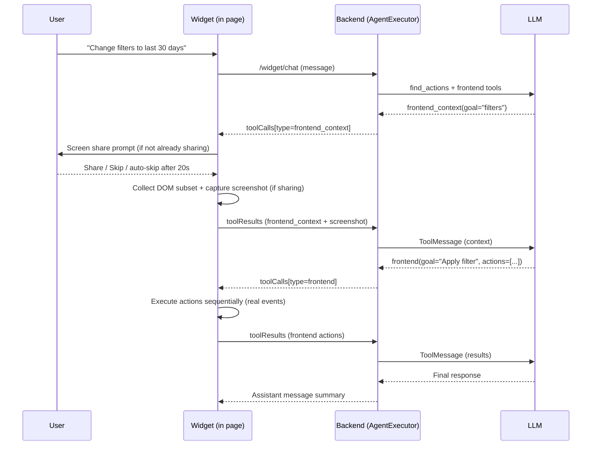
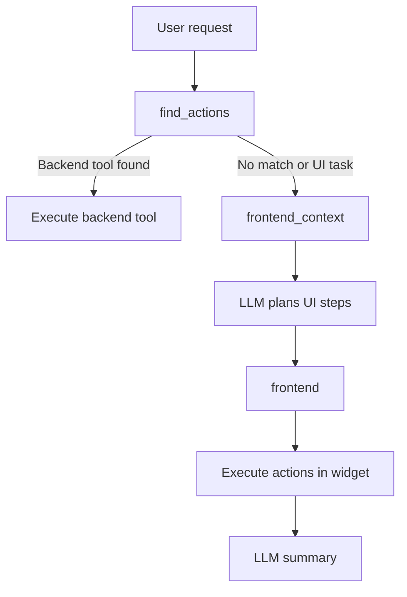

# Frontend Agent Capability (Widget)

## Overview
The Warpy agent can observe and act on the host dashboard directly. Two always-available tools give it this ability:

- **`frontend_context`** — requests a focused DOM snapshot of the current page. When the user has granted tab screen sharing, it also captures a pixel-perfect screenshot.
- **`frontend`** — executes ordered UI actions (click, type, select, scroll, drag, etc.) on the current page by simulating real user interactions.

Tool calls use a `type` discriminator (`backend`, `frontend_context`, `frontend`) so the widget knows how to execute each one. Billing is backend-controlled based on `tool_type`.

## Capabilities
- DOM context collection with relevance scoring and strict size limits.
- Tab screen sharing via `getDisplayMedia` to enrich context with a real screenshot (inline prompt with 20s countdown auto-skip).
- Client-side action engine that simulates real user interactions across frameworks (React, Vue, Angular).
- UI feedback for page actions: status panel, element highlight, frontend-interaction warning lifecycle.
- User stop control while runs are in progress (Send becomes Stop).
- Resumable error handling with a Resume button tied to the failed query (consecutive duplicates collapsed).
- System prompt encourages proactive frontend retries and context rescans.
- Frontend actions tracked in the Activity panel alongside backend actions.

## High-level flow


## Decision path


## Tool contracts
### Tool call schema (widget response)
All tool calls returned to the widget include a `type` discriminator:
- `backend` (API endpoint calls)
- `frontend_context` (DOM snapshot, read-only)
- `frontend` (UI actions, billable)

Example: frontend context tool call
```json
{
  "id": "call_1",
  "type": "frontend_context",
  "name": "frontend_context",
  "goal": "filters date range",
  "context": {
    "goal": "filters date range",
    "maxElements": 60,
    "selectorHints": ["text=Date range"]
  }
}
```

Example: frontend actions tool call
```json
{
  "id": "call_2",
  "type": "frontend",
  "name": "frontend",
  "goal": "Apply last 30 days filter",
  "actions": [
    { "action": "click", "selector": "[data-testid=filter-button]" },
    { "action": "click", "selector": "text=Last 30 days" },
    { "action": "click", "selector": "text=Apply" }
  ]
}
```

### Tool results (widget -> backend)
Tool results contain the execution outcome:
```json
{
  "id": "call_2",
  "statusCode": 200,
  "body": {
    "kind": "frontend_actions",
    "goal": "Apply last 30 days filter",
    "url": "https://example.com/dashboard",
    "results": [
      { "index": 0, "action": "click", "selector": "[data-testid=filter-button]", "status": "ok", "durationMs": 42 },
      { "index": 1, "action": "click", "selector": "text=Last 30 days", "status": "ok", "durationMs": 38 }
    ]
  }
}
```

Frontend context results:
```json
{
  "id": "call_1",
  "statusCode": 200,
  "body": {
    "kind": "frontend_context",
    "goal": "filters date range",
    "url": "https://example.com/dashboard",
    "elements": [
      { "selector": "#date-range", "label": "Date range" }
    ],
    "screenshot": "data:image/webp;base64,..."
  }
}
```
The `screenshot` field is present only when the user has granted tab screen sharing. It contains a base64-encoded WebP image of the current tab captured via `getDisplayMedia`.

## Billing
Billing is controlled entirely by the backend based on `tool_type`:

| Tool Type | Billable | Reason |
|-----------|----------|--------|
| `backend` | Yes | API call executed |
| `frontend` | Yes | DOM actions performed |
| `frontend_context` | No | Read-only DOM snapshot |

The backend determines billability by checking the `tool_type` stored in pending state when processing tool results. This prevents clients from bypassing billing.

## DOM context collection
The widget generates a small, relevant snapshot instead of sending the full DOM.

Selection strategy:
- Collect interactive elements only (buttons, inputs, selects, links, ARIA roles, contenteditable).
- Filter by visibility and viewport.
- Score elements using goal tokens against label/text/attributes.
- Limit results (default 60 elements; capped at 160).

Each element includes:
- `selector` and `selectors` (best-effort CSS selectors)
- `label`, `text`, `ariaLabel`, `placeholder`, `name`, `id`
- `tag`, `role`, `type`, `disabled`, `checked`, `required`
- `rect` and `inViewport`
- `options` for select elements (when small)

## Tab screenshot capture
When `frontend_context` is called, the widget attempts to capture a screenshot of the current tab via the browser `getDisplayMedia` API. This gives the agent a pixel-perfect view of the page alongside the structured DOM context.

Flow:
1. On the first `frontend_context` call, the widget shows an inline prompt asking the user to share the current tab.
2. The prompt includes a 20-second countdown. If the user doesn't act, it auto-skips and continues without a screenshot.
3. The user can click **Share** (triggers the browser's tab-sharing picker) or **Skip**.
4. `getDisplayMedia` is configured with `preferCurrentTab: true`, `selfBrowserSurface: "include"`, `monitorTypeSurface: "exclude"`, and `surfaceSwitching: "exclude"` to restrict sharing to the current tab only.
5. Once sharing is active, every subsequent `frontend_context` call captures a frame without re-prompting.
6. The frame is drawn to an offscreen canvas and exported as `image/webp` at 0.75 quality, then included in the tool result as a base64 data URL in the `screenshot` field.

The sharing bar persists across messages (including empty/new-chat state) so the user always has a visible **Stop** control. Sharing is fully optional — the agent receives structured DOM context regardless.

## Action execution engine
The widget executes actions sequentially to preserve correct UI state. It simulates user events to trigger framework handlers (React/Vue/Angular):

Supported action families:
- Mouse: `click`, `double_click`, `right_click`, `hover`
- Focus: `focus`, `blur`
- Text: `type`, `input`, `set_value`, `clear`
- Select: `select`, `check`, `uncheck`
- Keys: `press`
- Navigation: `navigate`
- Scrolling: `scroll`, `scroll_into_view`
- Timing: `wait`, `wait_for`, `wait_for_text`
- Drag: `drag`, `drag_and_drop`
- Custom: `dispatch` (arbitrary events)

Actions accept:
- `selector` (CSS) or `text=` / `label=` / `role=` query shortcuts
- `value` / `text` / `key` / `keys`
- `timeoutMs`, `delayMs`, `continueOnError`
- Optional coordinates `x`, `y` (relative 0-1 or px)

## UI/UX feedback
- Status panel at the top of the conversation shows in-flight steps.
- Per-step status updates (pending/running/done/error).
- Highlight box around the current target element.
- Status auto-clears shortly after completion.
- Frontend-interaction warning appears slightly before frontend actions run, remains visible for a minimum duration, and persists briefly after completion.
- Warning is visible both when the panel is open (inline subtle alert) and when collapsed (launcher-adjacent subtle alert).
- While a run is active and the panel is open, Send is replaced by an immediate Stop button.
- Default execution failures render a Resume button that retries the original failed query; consecutive duplicate resume errors are collapsed into a single latest message.
- Screen share prompt: a minimal inline bar (sticky at the top of the messages area) with a status dot, descriptive text, and Share/Skip actions. Uses the same design tokens as the rest of the widget (`.cta-widget-screen-prompt`). Shows a live countdown ("Continuing in Xs") on a second line. When sharing is active, the bar changes to "Sharing this tab" with a pulsing dot and a "Stop" link. The bar remains visible in the empty-state/new-chat view so users always have access to the stop control.

## Activity panel
Frontend actions are recorded and displayed in the Activity panel alongside backend actions:
- Each frontend action shows the goal, URL, and individual DOM actions performed.
- Actions are stored with `tool_type="frontend"` in the `conversation_actions` table.
- The panel displays action status, timing, and any errors.

## Safety and privacy
- Frontend context is only requested when needed.
- Context is DOM-only, capped, and scored to limit payload size.
- Frontend actions are sequential and retryable with rescans.
- Sensitive field sanitization: text typed into password/secret/token fields is redacted (`***`) before storage.
- The `goal` parameter is required for frontend actions to ensure meaningful activity labels.
- Tab screen sharing requires explicit user consent via the browser's native permission dialog.
- The `getDisplayMedia` call is restricted to the current tab only — users cannot share other tabs, windows, or their entire screen.
- Screen sharing is fully optional; the user can skip or ignore the prompt and the agent continues with DOM context only.
- The user can stop sharing at any time via the widget's "Stop" control or the browser's built-in stop-sharing UI.
- Screenshots are captured client-side, encoded as base64, and sent inline with the tool result — no images are uploaded to external storage.
- Screen share state is cleaned up on widget hide, new chat, and abort to prevent hidden ongoing capture.

## Architecture

### Backend
- Tool schemas: `FrontendContextRequest`, `FrontendActionPayload`.
- `ToolCallPayload` includes `type`, `goal`, `context`, `actions`.
- `AgentExecutor` routes `frontend_context` and `frontend` tool calls to the widget for client-side execution.
- `ConversationAction` model stores `tool_type`, `frontend_goal`, `frontend_url`, `frontend_actions`.
- Billing determined by `tool_type` on the backend (not client flags).

### Widget
- DOM context capture with relevance scoring.
- Action engine for UI interactions (user-like events dispatched to framework handlers).
- Activity UI and element highlighting.
- Host-token theming: widget colors and typography resolve from host design tokens first (`background`, `foreground`, `muted`, `card/popover`, `border`, `primary/accent`, `ring`) with safe computed-style fallbacks.
- Border tuning: launcher/icon borders use a slightly stronger subtle border token; other widget borders stay softer.
- Tab screenshot capture via `getDisplayMedia` with current-tab-only constraints.
- Screen share prompt UI: minimal sticky bar with countdown, share/skip actions, and active-sharing status with stop control.
- `screenShareEndedCallback` hook re-renders the widget when the user stops sharing from the browser chrome.

## Competitive landscape (brief)
- Perplexity Comet positions itself as an AI browser that can click, type, submit, and autofill in the browser, emphasizing agentic actions inside the page. Source: Perplexity Comet Enterprise page. [1]
- OpenAI ChatGPT Atlas introduces a browser with built-in agent mode that can take actions in the user's browser and work with browsing context. Source: OpenAI Atlas announcement. [2]
- Claude Code focuses on selective context acquisition and execution inside the user's environment (terminal/IDE), highlighting agentic workflows with minimal context switching. Source: Claude Code product page. [3]

## References
1. https://www.perplexity.ai/enterprise/comet
2. https://openai.com/index/introducing-chatgpt-atlas/
3. https://www.anthropic.com/claude-code/
