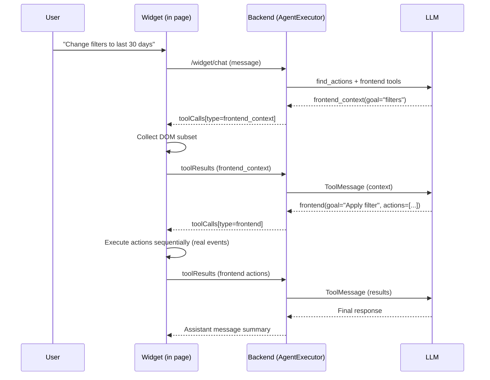
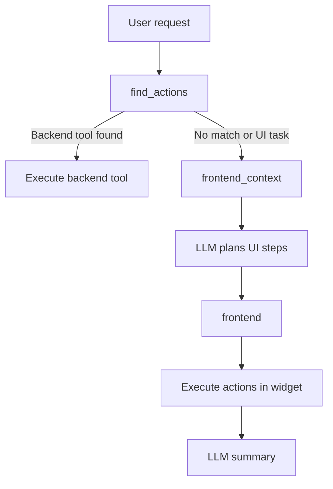

# Frontend Agent Capability (Widget)

Date: 2026-01-25

## Overview
This document describes the frontend action capability added to the Warpy agent, how it works end-to-end, and the key implementation details (backend, widget, UI/UX, and safety/performance). It also includes a brief competitive landscape summary and diagrams.

## What changed
- Added two always-available agent tools:
  - `frontend_context`: request a focused DOM snapshot only when needed.
  - `frontend`: execute ordered UI actions on the current page.
- Extended widget tool calls with a `type` discriminator (`backend`, `frontend_context`, `frontend`).
- Backend-controlled billing: the backend determines what actions to bill based on `tool_type`, not client flags.
- Implemented a client-side action engine that simulates real user interactions (click, type, select, scroll, drag, etc.).
- Added DOM context collection with relevance scoring and strict size limits.
- Added UI feedback for page actions (status panel + element highlight).
- Updated the system prompt to encourage proactive frontend retries and context rescans.
- Frontend actions now appear in the Activity panel alongside backend actions.

## High-level flow


## Decision path


## Tool contracts
### Tool call schema (widget response)
All tool calls returned to the widget include a `type` discriminator:
- `backend` (API endpoint calls)
- `frontend_context` (DOM snapshot, read-only)
- `frontend` (UI actions, billable)

Example: frontend context tool call
```json
{
  "id": "call_1",
  "type": "frontend_context",
  "name": "frontend_context",
  "goal": "filters date range",
  "context": {
    "goal": "filters date range",
    "maxElements": 60,
    "selectorHints": ["text=Date range"]
  }
}
```

Example: frontend actions tool call
```json
{
  "id": "call_2",
  "type": "frontend",
  "name": "frontend",
  "goal": "Apply last 30 days filter",
  "actions": [
    { "action": "click", "selector": "[data-testid=filter-button]" },
    { "action": "click", "selector": "text=Last 30 days" },
    { "action": "click", "selector": "text=Apply" }
  ]
}
```

### Tool results (widget -> backend)
Tool results contain the execution outcome:
```json
{
  "id": "call_2",
  "statusCode": 200,
  "body": {
    "kind": "frontend_actions",
    "goal": "Apply last 30 days filter",
    "url": "https://example.com/dashboard",
    "results": [
      { "index": 0, "action": "click", "selector": "[data-testid=filter-button]", "status": "ok", "durationMs": 42 },
      { "index": 1, "action": "click", "selector": "text=Last 30 days", "status": "ok", "durationMs": 38 }
    ]
  }
}
```

Frontend context results:
```json
{
  "id": "call_1",
  "statusCode": 200,
  "body": {
    "kind": "frontend_context",
    "goal": "filters date range",
    "url": "https://example.com/dashboard",
    "elements": [
      { "selector": "#date-range", "label": "Date range" }
    ]
  }
}
```

## Billing
Billing is controlled entirely by the backend based on `tool_type`:

| Tool Type | Billable | Reason |
|-----------|----------|--------|
| `backend` | Yes | API call executed |
| `frontend` | Yes | DOM actions performed |
| `frontend_context` | No | Read-only DOM snapshot |

The backend determines billability by checking the `tool_type` stored in pending state when processing tool results. This prevents clients from bypassing billing.

## DOM context collection
The widget generates a small, relevant snapshot instead of sending the full DOM.

Selection strategy:
- Collect interactive elements only (buttons, inputs, selects, links, ARIA roles, contenteditable).
- Filter by visibility and viewport.
- Score elements using goal tokens against label/text/attributes.
- Limit results (default 60 elements; capped at 160).

Each element includes:
- `selector` and `selectors` (best-effort CSS selectors)
- `label`, `text`, `ariaLabel`, `placeholder`, `name`, `id`
- `tag`, `role`, `type`, `disabled`, `checked`, `required`
- `rect` and `inViewport`
- `options` for select elements (when small)

## Action execution engine
The widget executes actions sequentially to preserve correct UI state. It simulates user events to trigger framework handlers (React/Vue/Angular):

Supported action families:
- Mouse: `click`, `double_click`, `right_click`, `hover`
- Focus: `focus`, `blur`
- Text: `type`, `input`, `set_value`, `clear`
- Select: `select`, `check`, `uncheck`
- Keys: `press`
- Navigation: `navigate`
- Scrolling: `scroll`, `scroll_into_view`
- Timing: `wait`, `wait_for`, `wait_for_text`
- Drag: `drag`, `drag_and_drop`
- Custom: `dispatch` (arbitrary events)

Actions accept:
- `selector` (CSS) or `text=` / `label=` / `role=` query shortcuts
- `value` / `text` / `key` / `keys`
- `timeoutMs`, `delayMs`, `continueOnError`
- Optional coordinates `x`, `y` (relative 0-1 or px)

## UI/UX feedback
- Status panel at the top of the conversation shows in-flight steps.
- Per-step status updates (pending/running/done/error).
- Highlight box around the current target element.
- Status auto-clears shortly after completion.

## Activity panel
Frontend actions are recorded and displayed in the Activity panel alongside backend actions:
- Each frontend action shows the goal, URL, and individual DOM actions performed.
- Actions are stored with `tool_type="frontend"` in the `conversation_actions` table.
- The panel displays action status, timing, and any errors.

## Safety and privacy
- Frontend context is only requested when needed.
- Context is DOM-only, capped, and scored to limit payload size.
- Frontend actions are sequential and retryable with rescans.
- Sensitive field sanitization: text typed into password/secret/token fields is redacted (`***`) before storage.
- The `goal` parameter is required for frontend actions to ensure meaningful activity labels.

## Key backend updates
- New tool schemas: `FrontendContextRequest`, `FrontendActionPayload`.
- `ToolCallPayload` now includes `type`, `goal`, `context`, `actions`.
- `AgentExecutor` understands `frontend_context` and `frontend` tool calls.
- `ConversationAction` model extended with `tool_type`, `frontend_goal`, `frontend_url`, `frontend_actions` columns.
- Backend-controlled billing based on `tool_type` (not client flags).

## Key widget updates
- DOM context capture with relevance scoring.
- Action engine for UI interactions (user-like events).
- Activity UI and element highlighting.

## Competitive landscape (brief)
- Perplexity Comet positions itself as an AI browser that can click, type, submit, and autofill in the browser, emphasizing agentic actions inside the page. Source: Perplexity Comet Enterprise page. [1]
- OpenAI ChatGPT Atlas introduces a browser with built-in agent mode that can take actions in the user's browser and work with browsing context. Source: OpenAI Atlas announcement. [2]
- Claude Code focuses on selective context acquisition and execution inside the user's environment (terminal/IDE), highlighting agentic workflows with minimal context switching. Source: Claude Code product page. [3]

## References
1. https://www.perplexity.ai/enterprise/comet
2. https://openai.com/index/introducing-chatgpt-atlas/
3. https://www.anthropic.com/claude-code/
